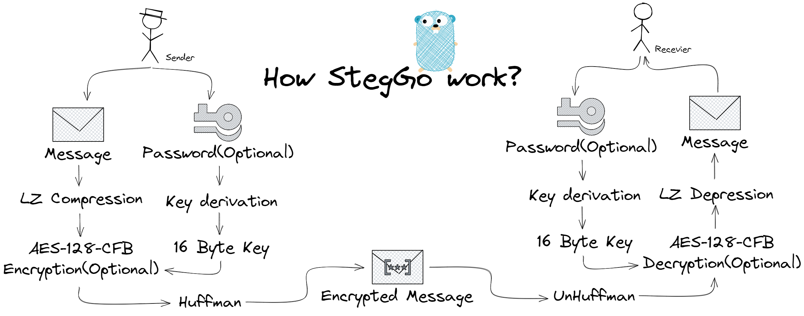

# StegGo

使用密码安全地把信息隐藏在不可见字符中。它可用于安全地为字符串、网页上的脚本、社交媒体上的文本或任何其他隐蔽通信添加水印。

## 安装

```shell
go get github.com/asjdf/steggo 
```

## 使用

```go
import "github.com/asjdf/steggo"


func main() {
    plain := []byte("steggo")
    encode, err := Encode(plain)
    decode, err := Decode(encode)

    password := []byte("atom") // you can also encode and decode with password
    encode, err := Encode(plain, password)
    decode, err := Decode(encode, password)
}
```

## 工作原理



StegGo 的基本原理是零宽字符。零宽字符是非打印字符，是 Unicode 中定义的一些字符。
顾名思义，零宽字符在显示的时候宽度为零（可以理解为不显示出来）。
他们主要用于启用长单词换行、连接表情符号、连接两个字符或是阻止两个字符连接。

这里我简单列举一些常用的零宽字符

1. 零宽度空格符 (zero-width space) `U+200B` : 用于较长单词的换行分隔
2. 零宽度非断空格符 (zero width no-break space) `U+FEFF` : 用于阻止特定位置的换行分隔
3. 零宽度连字符 (zero-width joiner) `U+200D` : 用于阿拉伯文与印度语系等文字中，使不会发生连字的字符间产生连字效果
4. 零宽度断字符 (zero-width non-joiner) `U+200C` : 用于阿拉伯文，德文，印度语系等文字中，阻止会发生连字的字符间的连字效果
5. 左至右符 (left-to-right mark) `U+200E` : 用于在混合文字方向的多种语言文本中（例：混合左至右书写的英语与右至左书写的希伯来语），规定排版文字书写方向为左至右
6. 右至左符 (right-to-left mark) `U+200F` : 用于在混合文字方向的多种语言文本中，规定排版文字书写方向为右至左

可以看出有不少零宽字符在特定语系中是不可或缺的，但是并不是所有的零宽字符都可以被用于帮助我们隐藏信息，如 Gmail 就将`U+200B`列入了黑名单、Twitter将不必要的不可见字符列入了黑名单、`U+180E`在iOS设备中并不是不可见的而且显示得非常怪异。

根据前辈在 Unicode 表中的探索（他们测试了每个不可见字符的跨平台/应用的不可见性），有6个可用的不可见字符能够用于隐藏信息。

在 StegGo 中我们进行了如下定义：

```go
// HuffmanConvertMap
const (
	BIT00   = "\u200c"
	BIT01   = "\u200d"
	BIT10   = "\u2060"
	BIT11   = "\u2062"
	BIT0101 = "\u2063"
	BIT0000 = "\u2064"
)
```

而隐藏工作实际上就是进行转换。例如加密以下字节：

```h
01 10 11 00 00 01 01 00
```

根据转换表进行第一轮转换，每两个比特进行一次转换，得到以下字符串（为方便理解这里使用变量名称指代字符，下同）：

```
BIT01 BIT10 BIT11 BIT00 BIT00 BIT01 BIT01 BIT00
```

多出的两个不可见字符被用于进一步压缩字符串长度，当遇到两个连续出现的`01` 或是 `00` 时（这两种组合方式较为常见），其会被字符 `BIT0101` 或 `BIT0000` 将其替换。

因此第二轮替换的结果为：

```
BIT01 BIT10 BIT11 BIT0000 BIT0101 BIT00
```

原始代码也非常简单：

```go
func Huffman(b []byte) string {
	out := ""
	for i := 0; i < len(b); i++ {
		for j := uint(0); j < 8; j = j + 2 {
			s := HuffmanMap[b[i]&(0x03<<j)>>j]
			out += s
		}
	}
	out = strings.ReplaceAll(out, BIT01+BIT01, BIT0101)
	out = strings.ReplaceAll(out, BIT00+BIT00, BIT0000)
	return out
}
```

反之亦然，解隐藏只不过是将字符串重新映射到比特。

当然为了尽可能降低不可见字符串的长度，StegGo 在进行字节转不可见字符之前将对原始的字节数组进行一次LZ压缩，随后根据需要进行加密工作（因为加密将会影响压缩率，所以在压缩后实施）。
